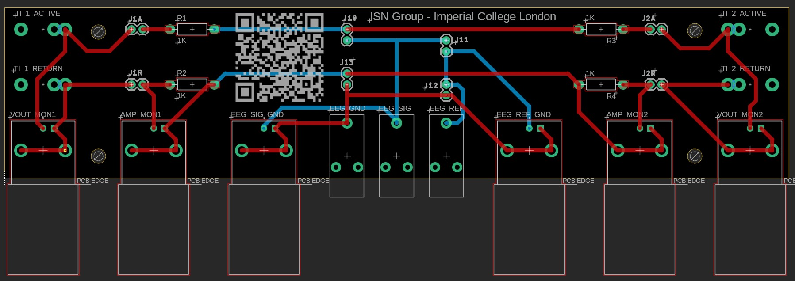
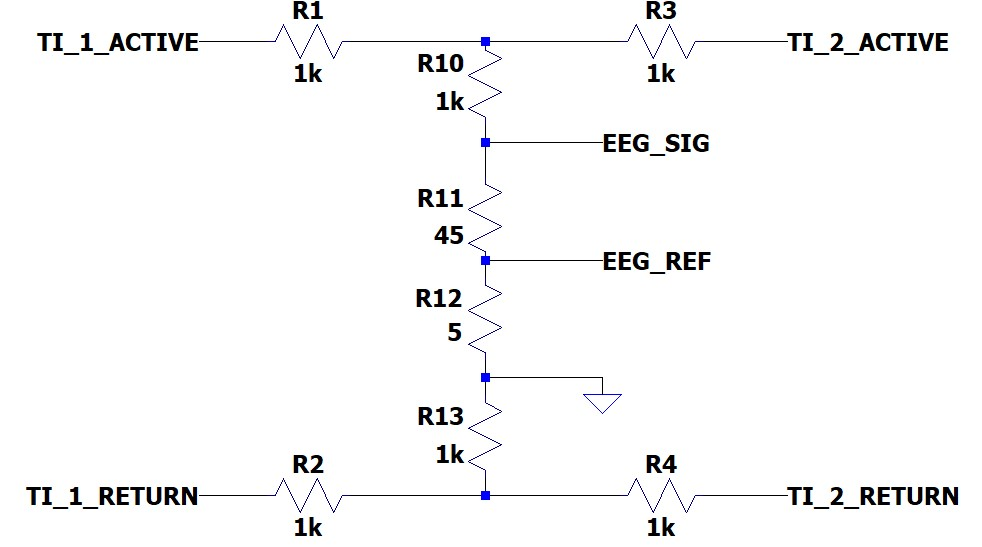

# ti-testing-pcb

Documentation and files for a Hardware-Testing PCB, a load for characterising and/or testing hardware (stimulation and recording) to be used in [Temporal Interference](https://doi.org/10.1016%2Fj.cell.2017.05.024) stimulation experiment preparation.

Using this PCB requires a **stimulator** which can be in the form of a dedicated Temporal Interference (TI) stimulator (two waveform outputs with active and return each); or two discrete current sources (that can output at frequencies above 1kHz). An oscillocope is also required, or some way of viewing/measuring voltage signals from the PCB.

This PCB was distributed during the [2024 International Meeting on Temporal Interference Brain Stimulation, London](https://www.imperial.ac.uk/dementia-research-institute/seminars-and-events/events/international-meeting-on-temporal-interference-brain-stimulation/). Link for purchasing additional units to be added soon.

The PCB has the following components:
|Component|Amount|Gender|Type|
|-|-|-|-|
|2mm Banana Connectors|4|Female|Input|
|PCB 2-pin Header Connectors|4|Male|Interface|
|Header Connector Jumpers|4|Female|Interface|
|PCB 2-pin Header Connectors|4|Female|Common|
|BNC sockets|6|Female|Output|
|1.5mm EEG Touchproof Connectors|3|Male|Output|

## PCB Description

### Inputs

The PCB has four inputs (in the form of 2mm banana connectors) labelled on the PCB as:

- TI_1_ACTIVE
- TI_1_RETURN
- TI_2_ACTIVE
- TI_2_RETURN

The four connections accomodate 1x active electrode and 1x return electrode per TI waveform. There is a BNC port to monitor the voltage across the active and return inputs, in order to characterise the voltage at the output of the stimulator.

### Interface Components

Each of the four inputs are routed to a 2-pin male header connector, labelled on the PCB as:

- J1A
- J1R
- J2A
- J2R

These connectors serve as ports for any possible components which the tester would like to include before the resistive load (for example; reactive elements, or an electrochemical interface). However, these pins can be shorted out (with a header-jumper) by default.

A 1kOhm resistor is placed in series with each input (R1, R2, R3 and R4) before they reach the common load components - this serves to protect the stimulator outputs from short-circuiting, as well as provide a defined resistance across which the voltage can be monitored in order to infer the current amplitude being output for each stimulation waveform (Ohm's Law; V=IR).

- There are two BNC outputs for exactly this at the outer edges of the PCB; one per stimulation waveform. Only the voltage across the 1kOhm resistor in the return path is probed.

### Common Components

There are four common components on the PCB, labelled on the PCB as:

- J10
- J11
- J12
- J13

It is up to the tester to determine which impedance values are suitable here and insert them to the 2-pin female header connectors. The process for choosing appropriate impedance values is described in [this document](./docs/choosingimpedance.md).

Firstly, the tester can decide to short all or none of these connectors as they see fit. It is designed such that the tester can use these four components to control the following key hardware parameters:

- Voltage(s) at the output of the stimulator
- Voltage(s) at the input of any recording amplifier or filter

The voltage at the output of the stimulator is controlled by the sum of the four common impedances, along with the appropriate interface resistors, and any components if included in the interface connector(s).

The voltage at the input to a recording amplifier or filter is determined by the inner two common impedances, J11 and J12. This PCB only supports emulation of three EEG channels: 1 signal, 1 reference and 1 ground. EEG signal voltage is determined by the sum of the two inner impedances (J11 + J12), and EEG reference voltage is determined by the impedance in J12 alone.

### Outputs

There are 9 outputs of the PCB, in the form of 6x BNC sockets as well as 3x 1.5mm EEG Touchproof connectors.

|Output PCB Label|Physical Interface|Purpose|Notes|
|-|-|-|-|
|VOUT_MON1|BNC Female|Potential difference between TI 1 Active and Return|~|
|VOUT_MON2|BNC Female|Potential difference between TI 2 Active and Return|~|
|AMP_MON1|BNC Female|Voltage representing current waveform of TI 1|Must divide voltage amplitude by 1k for corresponding current amplitude|
|AMP_MON2|BNC Female|Voltage representing current waveform of TI 2|Must divide voltage amplitude by 1k for corresponding current amplitude|
|EEG_SIG_GND|BNC Female|Potential difference between point on PCB serving as EEG channel potential and point on PCB serving as EEG GND potential|~|
|EEG_REF_GND|BNC Female|Potential difference between point on PCB serving as EEG reference potential and point on PCB serving as EEG GND potential|~|
|EEG_SIG|1.5mm Touchproof Male|Point on PCB serving as EEG channel signal|Same potential as inner conductor of EEG_SIG_GND|
|EEG_REF|1.5mm Touchproof Male|Point on PCB serving as EEG reference|Same potential as inner conductor of EEG_REF_GND|
|EEG_GND|1.5mm Touchproof Male|Point on PCB serving as EEG GND potential|Same potential as outer conductors of EEG_SIG_GND and EEG_REF_GND|

## Reference Circuit Implementation Schematic

The schematic above shows a circuit which can be implemented on the PCB with the following components:

|PCB Connector Label|Impedance (Ohms)|Notes|
|-|-|-|
|J1A|0|Short-circuited|
|J1R|0|Short-circuited|
|J2A|0|Short-circuited|
|J2R|0|Short-circuited|
|J10|1k|1x Resistor|
|J11|45|1x Resistor|
|J12|5|1x Resistor|
|J13|1k|1x Resistor|

If the stimulator used for temporal interference is set to output 2mA for each channel, this particular configuration will result in the following voltage parameters:

|Signal|Unit|Value|
|-|-|-|
|TI1 Active-Return Potential Difference|V|12.2|
|TI2 Active-Return Potential Difference|V|12.2|
|EEG SIG_GND Potential Difference|V|0.2|
|EEG REF_GND Potential Difference|V|0.02|

The spreadsheet '*ImpedanceCalculator.xlsx*' can be used to get a quick estimate for expected voltage parameters for given impedance values, on the sheet named 'Voltage Calculator'. It is critical to **test** the *actual* values, one can do so by following the test procedures linked to below. The reader is reminded that the process for choosing appropriate impedance values is described in [this document](./docs/choosingimpedance.md).

## TI Hardware Test Examples

The PCB can be used for testing TI stimulation equipment in a variety of ways. This documentation introduces three critical tests, linked below:

- [Test 1: Stimulator Current Output](./docs/test1.md)
- [Test 2: Stimulator Channel Isolation](./docs/test2.md)
- [Test 3: Intermodulation Distortion (Recording during Stimulation)](./docs/test3.md)
